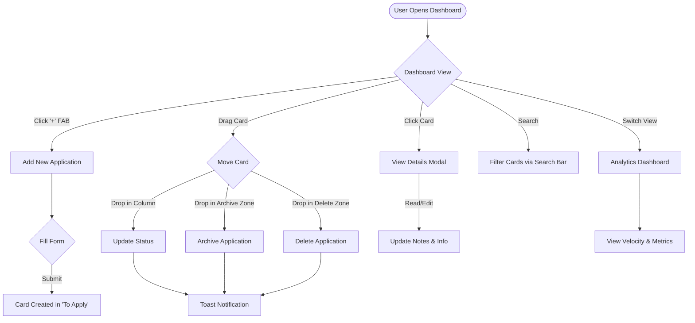

# 🚀 AI Job Application Tracking System

A premium, local-first Kanban dashboard designed to streamline your job search journey. Track applications, manage interviews, and visualize your progress with a modern, glassmorphism-inspired UI.

 

## ✨ Key Features

### 📋 Intelligent Kanban Board
- **Drag & Drop Workflow**: Effortlessly move applications between stages (To Apply, Applied, Interview, Offer, Rejected).
- **Visual Feedback**: Smooth animations and confetti celebrations when you land a job!
- **Smart Filtering**: Real-time search by company, role, or platform.

### 🔍 Advanced Tracking & Analytics
- **Detailed Consoles**: Track salary expectations, follow-up dates, HR contacts, and notes.
- **Velocity Insights**: Monitor your application rate (apps/week) and conversion metrics.
- **Resume Management**: Upload and attach specific resume versions to each application.

### 🎨 Premium User Experience
- **Theme Support**: Seamless Light & Dark mode toggle.
- **Toast Notifications**: Instant visual feedback for actions like Archiving, Deleting, or Updating.
- **Responsive Design**: precise layout that works on desktop and mobile.

## 🔄 Application Flow



## 🚀 Getting Started

No complex build steps required! This project uses a no-build architecture for maximum simplicity.

1. **Clone the Repository**
   ```bash
   git clone https://github.com/bhaumikgohel/AI-Job-Application-Tracking.git
   ```

2. **Run the App**
   - Simply double-click `index.html` to open it in your browser.
   - Or serve it using a local server like Live Server for VS Code.

3. **Data Privacy**
   - All data is stored locally in your browser's `localStorage`.
   - No external database or API keys required.

## ☁️ Deployment

Deploy your own version for free in less than 30 seconds using Vercel.

**Option 1: Vercel Dashboard (Recommended)**
1. Go to the [Vercel Dashboard](https://vercel.com/new).
2. Click **"Add New..."** -> **"Project"**.
3. Import your GitHub repository: `AI-Job-Application-Tracking`.
4. Click **Deploy**. Vercel will automatically detect the static configuration.

**Option 2: Vercel CLI**
If you have node installed:
```bash
npm i -g vercel
vercel --prod
```

## 🛠️ Tech Stack

- **Frontend**: React 18 (via CDN)
- **Styling**: Modern CSS3 (Variables, Flexbox, Grid, Glassmorphism)
- **Icons**: Lucide Icons
- **Compiler**: Babel (Standalone)

---

*Built with ❤️ for improved career productivity.*

**Developed by Bhaumik Gohel**
